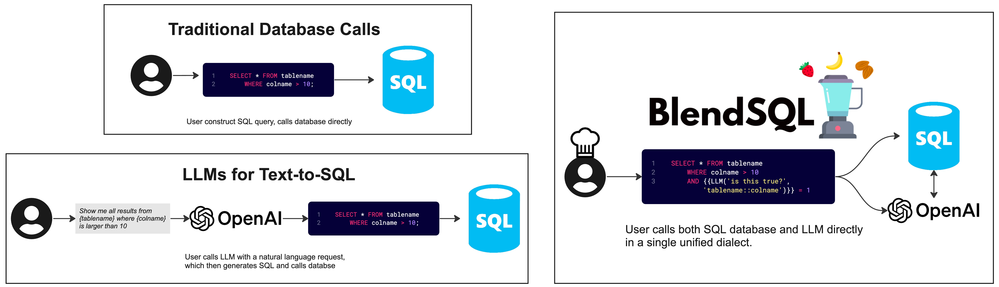

<div align="right">
<a href="https://opensource.org/licenses/Apache-2.0"></a>
<a></a>
<a></a>
<a></a>
<br>
</div>

<div align="center"><picture>
  <source media="(prefers-color-scheme: dark)" srcset="docs/img/logo_dark.png">
  
</picture>
<p align="center">
    <i> SQL 🤝 LLMs </i>
  </p>
<b><h3>Check out our <a href="https://parkervg.github.io/blendsql/reference/functions/" target="_blank">online documentation</a> for a more comprehensive overview.</h3></b>
<b><h4>Join our <a href="https://discord.gg/vCv7ak3WrU" target="_blank">Discord server</a> for more discussion!</h4></b>
</div>
<br/>

# 💻 Installation
```
pip install blendsql
```

# ⭐ Quickstart
```python
import pandas as pd

from blendsql import BlendSQL
from blendsql.models import TransformersLLM, LiteLLM

USE_LOCAL_CONSTRAINED_MODEL = False

# Load model, either a local transformers model, or remote provider via LiteLLM
if USE_LOCAL_CONSTRAINED_MODEL:
    model = TransformersLLM(
        "meta-llama/Llama-3.2-3B-Instruct", config={"device_map": "auto"}
    )  # Local models enable BlendSQL's predicate-guided constrained decoding
else:
    model = LiteLLM("openai/gpt-4o-mini")

# Prepare our BlendSQL connection
bsql = BlendSQL(
    {
        "People": pd.DataFrame(
            {
                "Name": [
                    "George Washington",
                    "John Adams",
                    "Thomas Jefferson",
                    "James Madison",
                    "James Monroe",
                    "Alexander Hamilton",
                    "Sabrina Carpenter",
                    "Charli XCX",
                    "Elon Musk",
                    "Michelle Obama",
                    "Elvis Presley",
                ],
                "Known_For": [
                    "Established federal government, First U.S. President",
                    "XYZ Affair, Alien and Sedition Acts",
                    "Louisiana Purchase, Declaration of Independence",
                    "War of 1812, Constitution",
                    "Monroe Doctrine, Missouri Compromise",
                    "Created national bank, Federalist Papers",
                    "Nonsense, Emails I Cant Send, Mean Girls musical",
                    "Crash, How Im Feeling Now, Boom Clap",
                    "Tesla, SpaceX, Twitter/X acquisition",
                    "Lets Move campaign, Becoming memoir",
                    "14 Grammys, King of Rock n Roll",
                ],
            }
        ),
        "Eras": pd.DataFrame({"Years": ["1700-1800", "1800-1900", "1900-2000", "2000-Now"]}),
    },
    model=model,
    verbose=True,
)

smoothie = bsql.execute(
    """
    SELECT * FROM People P
    WHERE P.Name IN {{
        LLMQA('First 3 presidents of the U.S?', quantifier='{3}')
    }}
    """,
    infer_gen_constraints=True, # Is `True` by default
)

print(smoothie.df)
# ┌───────────────────┬───────────────────────────────────────────────────────┐
# │ Name              │ Known_For                                             │
# ├───────────────────┼───────────────────────────────────────────────────────┤
# │ George Washington │ Established federal government, First U.S. Preside... │
# │ John Adams        │ XYZ Affair, Alien and Sedition Acts                   │
# │ Thomas Jefferson  │ Louisiana Purchase, Declaration of Independence       │
# └───────────────────┴───────────────────────────────────────────────────────┘
print(smoothie.summary())
# ┌────────────┬──────────────────────┬─────────────────┬─────────────────────┐
# │   Time (s) │   # Generation Calls │   Prompt Tokens │   Completion Tokens │
# ├────────────┼──────────────────────┼─────────────────┼─────────────────────┤
# │    1.25158 │                    1 │             296 │                  16 │
# └────────────┴──────────────────────┴─────────────────┴─────────────────────┘


smoothie = bsql.execute(
    """
    SELECT GROUP_CONCAT(Name, ', ') AS 'Names',
    {{
        LLMMap(
            'In which time period was this person born?',
            p.Name,
            options=Eras.Years
        )
    }} AS Born
    FROM People p
    GROUP BY Born
    """,
)

print(smoothie.df)
# ┌───────────────────────────────────────────────────────┬───────────┐
# │ Names                                                 │ Born      │
# ├───────────────────────────────────────────────────────┼───────────┤
# │ George Washington, John Adams, Thomas Jefferson, J... │ 1700-1800 │
# │ Sabrina Carpenter, Charli XCX, Elon Musk, Michelle... │ 2000-Now  │
# │ Elvis Presley                                         │ 1900-2000 │
# └───────────────────────────────────────────────────────┴───────────┘
print(smoothie.summary())
# ┌────────────┬──────────────────────┬─────────────────┬─────────────────────┐
# │   Time (s) │   # Generation Calls │   Prompt Tokens │   Completion Tokens │
# ├────────────┼──────────────────────┼─────────────────┼─────────────────────┤
# │    1.03858 │                    2 │             544 │                  75 │
# └────────────┴──────────────────────┴─────────────────┴─────────────────────┘

smoothie = bsql.execute("""
    SELECT {{
        LLMQA(
            'Describe BlendSQL in 50 words.',
            context=(
                SELECT content[0:5000] AS "README"
                FROM read_text('https://raw.githubusercontent.com/parkervg/blendsql/main/README.md')
            )
        )
    }} AS answer
""")

print(smoothie.df)
# ┌─────────────────────────────────────────────────────┐
# │ answer                                              │
# ├─────────────────────────────────────────────────────┤
# │ BlendSQL is a Python library that combines SQL a... │
# └─────────────────────────────────────────────────────┘

print(smoothie.summary())

# ┌────────────┬──────────────────────┬─────────────────┬─────────────────────┐
# │   Time (s) │   # Generation Calls │   Prompt Tokens │   Completion Tokens │
# ├────────────┼──────────────────────┼─────────────────┼─────────────────────┤
# │    4.07617 │                    1 │            1921 │                  50 │
# └────────────┴──────────────────────┴─────────────────┴─────────────────────┘

```

# 📰 News
- (5/30/25) Created a [Discord server](https://discord.gg/vCv7ak3WrU)
- (5/6/25): New blog post: [Language Models, SQL, and Types, Oh My!](https://parkervg.github.io/misc/2025/05/05/sql-llms.html)
- (5/1/15): Single-page [function documentation](https://parkervg.github.io/blendsql/reference/functions/)
- (3/16/25) Use BlendSQL with 100+ LLM APIs, using [LiteLLM](https://github.com/BerriAI/litellm)!
- (10/26/24) New tutorial! [blendsql-by-example.ipynb](examples/blendsql-by-example.ipynb)
- (10/18/24) Concurrent async requests in 0.0.29! OpenAI and Anthropic `LLMMap` calls are speedy now.
  - Customize max concurrent async calls via `blendsql.config.set_async_limit(10)`

# Summary

BlendSQL is a *superset of SQL* for problem decomposition and hybrid question-answering with LLMs.

As a result, we can *Blend* together...

- 🥤 ...operations over heterogeneous data sources (e.g. tables, text, images)
- 🥤 ...the structured & interpretable reasoning of SQL with the generalizable reasoning of LLMs



**Now, the user is given the control to oversee all calls (LLM + SQL) within a unified query language.**

# Features

- Supports many DBMS 💾
  - SQLite, PostgreSQL, DuckDB, Pandas (aka duckdb in a trenchcoat)
- Supports local & remote models ✨
  - Transformers, OpenAI, Anthropic, Ollama, and 100+ more!
- Easily extendable to [multi-modal usecases](./examples/vqa-ingredient.ipynb) 🖼
- Write your normal queries - smart parsing optimizes what is passed to external functions 🧠
  - Traverses abstract syntax tree with [sqlglot](https://github.com/tobymao/sqlglot) to minimize LLM function calls 🌳
- Constrained decoding with [guidance](https://github.com/guidance-ai/guidance) 🚀
  - When using local models, we only generate syntactically valid outputs according to query syntax + database contents
- LLM function caching, built on [diskcache](https://grantjenks.com/docs/diskcache/) 🔑

# Example
For example, imagine we have the following table titled `parks`, containing [info on national parks in the United States](https://en.wikipedia.org/wiki/List_of_national_parks_of_the_United_States).

We can use BlendSQL to build a travel planning LLM chatbot to help us navigate the options below.


| **Name**        | **Image**                                                                       | **Location**       | **Area**                          | **Recreation Visitors (2022)** | **Description**                                                                                                                          |
|-----------------|---------------------------------------------------------------------------------|--------------------|-----------------------------------|--------------------------------|------------------------------------------------------------------------------------------------------------------------------------------|
| Death Valley    |        | California, Nevada | 3,408,395.63 acres (13,793.3 km2) | 1,128,862                      | Death Valley is the hottest, lowest, and driest place in the United States, with daytime temperatures that have exceeded 130 °F (54 °C). |
| Everglades      |            | Alaska             | 7,523,897.45 acres (30,448.1 km2) | 9,457                          | The country's northernmost park protects an expanse of pure wilderness in Alaska's Brooks Range and has no park facilities.              |
| New River Gorge |  | West Virgina       | 7,021 acres (28.4 km2)            | 1,593,523                      | The New River Gorge is the deepest river gorge east of the Mississippi River.                                                            |
 | Katmai          |                      | Alaska             |  3,674,529.33 acres (14,870.3 km2)                                 | 33,908 | This park on the Alaska Peninsula protects the Valley of Ten Thousand Smokes, an ash flow formed by the 1912 eruption of Novarupta.  |

BlendSQL allows us to ask the following questions by injecting "ingredients", which are callable functions denoted by double curly brackets (`{{`, `}}`).

_Which parks don't have park facilities?_
```sql
SELECT "Name", "Description" FROM parks p
  WHERE {{
      LLMMap(
          'Does this location have park facilities?',
          p.Description
      )
  }} = FALSE
```
| Name            | Description                                                                                                                            |
|:----------------|:---------------------------------------------------------------------------------------------------------------------------------------|
| Everglades      | The country's northernmost park protects an expanse of pure wilderness in Alaska's Brooks Range and has no park facilities.            |
<hr>

_What does the largest park in Alaska look like?_

```sql
SELECT "Name",
{{ImageCaption(Image)}} as "Image Description",
{{
    LLMMap(
        question='Size in km2?',
        values=Area
    )
}} as "Size in km" FROM parks p
WHERE "Location" = 'Alaska'
ORDER BY "Size in km" DESC LIMIT 1
```

| Name       | Image Description                                       |   Size in km |
|:-----------|:--------------------------------------------------------|-------------:|
| Everglades | A forest of tall trees with a sunset in the background. |      30448.1 |

<hr>

_Which state is the park in that protects an ash flow?_

```sql
SELECT Location, Name AS "Park Protecting Ash Flow" FROM parks
    WHERE Name = {{
      LLMQA(
        'Which park protects an ash flow?',
        context=(SELECT Name, Description FROM parks),
        options=Name
      )
  }}
```
| Location   | Park Protecting Ash Flow   |
|:-----------|:---------------------------|
| Alaska     | Katmai                     |

<hr>

_How many parks are located in more than 1 state?_

```sql
SELECT COUNT(*) FROM parks
    WHERE {{LLMMap('How many states?', Location)}} > 1
```
|   Count |
|--------:|
|       1 |
<hr>

_Give me some info about the park in the state that Sarah Palin was governor of._
```sql
SELECT "Name", "Location", "Description" FROM parks
/* Will gather relevant context via WebSearch, and automatically constrain output 
   to one of the values in 'parks.Location'*/
WHERE Location = {{WebSearchQA('Which state was Sarah Palin governor of?')}}
```
| Name       | Location   | Description                                                                                                                         |
|:-----------|:-----------|:------------------------------------------------------------------------------------------------------------------------------------|
| Everglades | Alaska     | The country's northernmost park protects an expanse of pure wilderness in Alaska's Brooks Range and has no park facilities.         |
| Katmai     | Alaska     | This park on the Alaska Peninsula protects the Valley of Ten Thousand Smokes, an ash flow formed by the 1912 eruption of Novarupta. |
<hr>

_What's the difference in visitors for those parks with a superlative in their description vs. those without?_
```sql
SELECT SUM(CAST(REPLACE("Recreation Visitors (2022)", ',', '') AS integer)) AS "Total Visitors",
{{LLMMap('Contains a superlative?', Description, options=('t', 'f'))}} AS "Description Contains Superlative",
GROUP_CONCAT(Name, ', ') AS "Park Names"
FROM parks
GROUP BY "Description Contains Superlative"
```
| Total Visitors |   Description Contains Superlative | Park Names                    |
|---------------:|-----------------------------------:|:------------------------------|
|          43365 |                                  0 | Everglades, Katmai            |
|        2722385 |                                  1 | Death Valley, New River Gorge |
<hr>

Now, we have an intermediate representation for our LLM to use that is explainable, debuggable, and [very effective at hybrid question-answering tasks](https://arxiv.org/abs/2402.17882).

For in-depth descriptions of the above queries, check out our [documentation](https://parkervg.github.io/blendsql/).


# Citation

```bibtex
@article{glenn2024blendsql,
      title={BlendSQL: A Scalable Dialect for Unifying Hybrid Question Answering in Relational Algebra},
      author={Parker Glenn and Parag Pravin Dakle and Liang Wang and Preethi Raghavan},
      year={2024},
      eprint={2402.17882},
      archivePrefix={arXiv},
      primaryClass={cs.CL}
}
```

# Few-Shot Prompting
For the LLM-based ingredients in BlendSQL, few-shot prompting can be vital. In `LLMMap`, `LLMQA` and `LLMJoin`, we provide an interface to pass custom few-shot examples and dynamically retrieve those top-`k` most relevant examples at runtime, given the current inference example.
#### `LLMMap`
- [Default examples](./blendsql/ingredients/builtin/map/default_examples.json)
- [All possible fields](./blendsql/ingredients/builtin/map/examples.py)

```python
from blendsql import BlendSQL
from blendsql.ingredients.builtin import LLMMap, DEFAULT_MAP_FEW_SHOT

ingredients = {
  LLMMap.from_args(
    few_shot_examples=[
      *DEFAULT_MAP_FEW_SHOT,
      {
        "question": "Is this a sport?",
        "mapping": {
          "Soccer": True,
          "Chair": False,
          "Banana": False,
          "Golf": True
        },
        # Below are optional
        "column_name": "Items",
        "table_name": "Table",
        "return_type": "boolean"
      }
    ],
    num_few_shot_examples=2,
    # How many inference values to pass to model at once
    batch_size=5,
  )
}

bsql = BlendSQL(db, ingredients=ingredients)
```

#### `LLMQA`
- [Default examples](./blendsql/ingredients/builtin/qa/default_examples.json)
- [All possible fields](./blendsql/ingredients/builtin/qa/examples.py)

```python
from blendsql import BlendSQL
from blendsql.ingredients.builtin import LLMQA, DEFAULT_QA_FEW_SHOT

ingredients = {
    LLMQA.from_args(
        few_shot_examples=[
            *DEFAULT_QA_FEW_SHOT,
            {
                "question": "Which weighs the most?",
                "context": {
                    {
                        "Animal": ["Dog", "Gorilla", "Hamster"],
                        "Weight": ["20 pounds", "350 lbs", "100 grams"]
                    }
                },
                "answer": "Gorilla",
                # Below are optional
                "options": ["Dog", "Gorilla", "Hamster"]
            }
        ],
        # Will fetch `k` most relevant few-shot examples using embedding-based retriever
        num_few_shot_examples=2,
        # Lambda to turn the pd.DataFrame to a serialized string
        context_formatter=lambda df: df.to_markdown(
            index=False
        )
    )
}

bsql = BlendSQL(db, ingredients=ingredients)
```

#### `LLMJoin`
- [Default examples](./blendsql/ingredients/builtin/join/default_examples.json)
- [All possible fields](./blendsql/ingredients/builtin/join/examples.py)

```python
from blendsql import BlendSQL
from blendsql.ingredients.builtin import LLMJoin, DEFAULT_JOIN_FEW_SHOT

ingredients = {
  LLMJoin.from_args(
    few_shot_examples=[
      *DEFAULT_JOIN_FEW_SHOT,
      {
        "join_criteria": "Join the state to its capital.",
        "left_values": ["California", "Massachusetts", "North Carolina"],
        "right_values": ["Sacramento", "Boston", "Chicago"],
        "mapping": {
          "California": "Sacramento",
          "Massachusetts": "Boston",
          "North Carolina": "-"
        }
      }
    ],
    num_few_shot_examples=2
  )
}

bsql = BlendSQL(db, ingredients=ingredients)
```


# Acknowledgements
Special thanks to those below for inspiring this project. Definitely recommend checking out the linked work below, and citing when applicable!

- The authors of [Binding Language Models in Symbolic Languages](https://arxiv.org/abs/2210.02875)
  - This paper was the primary inspiration for BlendSQL.
- The authors of [EHRXQA: A Multi-Modal Question Answering Dataset for Electronic Health Records with Chest X-ray Images](https://arxiv.org/pdf/2310.18652)
  - As far as I can tell, the first publication to propose unifying model calls within SQL
  - Served as the inspiration for the [vqa-ingredient.ipynb](./examples/vqa-ingredient.ipynb) example
- The authors of [Grammar Prompting for Domain-Specific Language Generation with Large Language Models](https://arxiv.org/abs/2305.19234)
- The maintainers of the [Guidance](https://github.com/guidance-ai/guidance) library for powering the constrained decoding capabilities of BlendSQL
