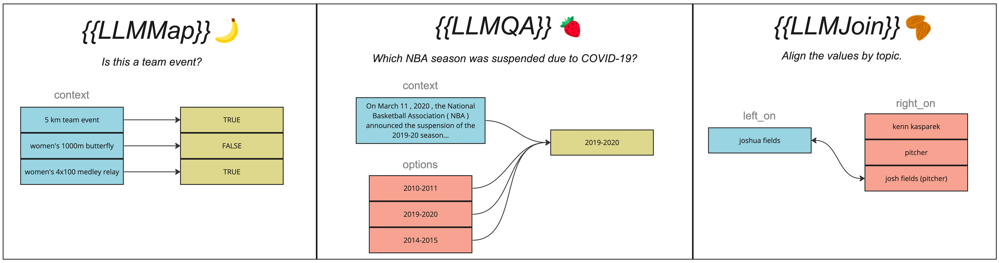

<div align="right">
<a href="https://opensource.org/licenses/Apache-2.0"></a>
<a></a>
<a></a>
<br>
</div>

<div align="center"><picture>
  <source media="(prefers-color-scheme: dark)" srcset="docs/img/logo_dark.png">
  
</picture>
<p align="center">
    <i> SQL 🤝 LLMs </i>
  </p>
<b>Check out our <a href="https://parkervg.github.io/blendsql/" target="_blank">online documentation</a> for a more comprehensive overview.</b>

<i>Results from the paper are available [here](https://github.com/parkervg/blendsql/tree/research-paper/research/paper-results)</i>
</div>
<br/>

## Intro
BlendSQL is a *superset of SQLite* for problem decomposition and hybrid question-answering with LLMs. 

As a result, we can *Blend* together...

- 🥤 ...operations over heterogeneous data sources (e.g. tables, text, images)
- 🥤 ...the structured & interpretable reasoning of SQL with the generalizable reasoning of LLMs

It can be viewed as an inversion of the typical text-to-SQL paradigm, where a user calls a LLM, and the LLM calls a SQL program.

**Now, the user is given the control to oversee all calls (LLM + SQL) within a unified query language.**


For example, imagine we have the following tables.

### `w`
| **date** | **rival**                 | **city**  | **venue**                   | **score** |
|----------|---------------------------|-----------|-----------------------------|-----------|
| 31 may   | nsw waratahs              | sydney    | agricultural society ground | 11-0      |
| 5 jun    | northern districts        | newcastle | sports ground               | 29-0      |
| 7 jun    | nsw waratahs              | sydney    | agricultural society ground | 21-2      |
| 11 jun   | western districts         | bathurst  | bathurst ground             | 11-0      |
| 12 jun   | wallaroo & university nsw | sydney    | cricket ground              | 23-10     |

### `documents`
| **title**                      | **content**                                       |
|--------------------------------|---------------------------------------------------|
| sydney                         | sydney ( /ˈsɪdni/ ( listen ) sid-nee ) is the ... |
| new south wales waratahs       | the new south wales waratahs ( /ˈwɒrətɑːz/ or ... |
| sydney showground (moore park) | the former sydney showground ( moore park ) at... |
| sydney cricket ground          | the sydney cricket ground ( scg ) is a sports ... |
| newcastle, new south wales     | the newcastle ( /ˈnuːkɑːsəl/ new-kah-səl ) met... |
| bathurst, new south wales      | bathurst /ˈbæθərst/ is a city in the central t... |

BlendSQL allows us to ask the following questions by injecting "ingredients", which are callable functions denoted by double curly brackets (`{{`, `}}`).
The below examples work out of the box, but you are able to design your own ingredients as well! 

*What was the result of the game played 120 miles west of Sydney?*
```sql
SELECT * FROM w
    WHERE city = {{
        LLMQA(
            'Which city is located 120 miles west of Sydney?',
            (SELECT * FROM documents WHERE documents MATCH 'sydney OR 120'),
            options='w::city'
        )
    }}
```

*Which venues in Sydney saw more than 30 points scored?*
```sql
SELECT DISTINCT venue FROM w
    WHERE city = 'sydney' AND {{
        LLMMap(
            'More than 30 total points?',
            'w::score'
        )
    }} = TRUE
```

*Show all NSW Waratahs games and a description of the team.*
```sql
SELECT date, rival, score, documents.content AS "Team Description" FROM w
    JOIN {{
        LLMJoin(
            left_on='documents::title',
            right_on='w::rival'
        )
    }} WHERE rival = 'nsw waratahs'
```

### More Examples from Popular QA Datasets

<p>
<details>
<summary> <b> <a href="https://hybridqa.github.io/" target="_blank"> HybridQA </a> </b> </summary>

For this setting, our database contains 2 tables: a table from Wikipedia `w`, and a collection of unstructured Wikipedia articles in the table `documents`.

*What is the state flower of the smallest state by area ?*
```sql
SELECT "common name" AS 'State Flower' FROM w 
WHERE state = {{
    LLMQA(
        'Which is the smallest state by area?',
        (SELECT title, content FROM documents),
        options='w::state'
    )
}}
```

*Who were the builders of the mosque in Herat with fire temples ?*
```sql
{{
    LLMQA(
        'Name of the builders?',
        (
            SELECT title AS 'Building', content FROM documents
                WHERE title = {{
                    LLMQA(
                        'Align the name to the correct title.',
                        (SELECT name FROM w WHERE city = 'herat' AND remarks LIKE '%fire temple%'),
                        options='documents::title'
                    )
                }}
        ) 
    )
}}
```

*What is the capacity of the venue that was named in honor of Juan Antonio Samaranch in 2010 after his death ?*
```sql
SELECT capacity FROM w WHERE venue = {{
    LLMQA(
        'Which venue is named in honor of Juan Antonio Samaranch?',
        (SELECT title AS 'Venue', content FROM documents),
        options='w::venue'
    )
}}
```    

</details>
</p>

<p>
<details>
<summary> <b> <a href="https://ott-qa.github.io/" target="_blank"> OTT-QA </a> </b> </summary>

Unlike HybridQA, these questions are open-domain, where we don't know in advance where the answer of a given open question appears in a passage or a table.

As a result, we need to play the role of both the retriever (to select relevant context) and reader (to read from relevant contexts and return the given answer).

As the underlying database consists of 400K tables and 5M documents, it's important to set `LIMIT` clauses appropriately to ensure reasonable execution times.

The examples below also demonstrate how BlendSQL unpacks [CTE statements](https://www.sqlite.org/lang_with.html) to ensure we only pass necessary data into the BlendSQL ingredient calls. 

*When was the third highest paid Rangers F.C . player born ?*
```sql
{{
    LLMQA(
        'When was the Rangers Player born?',
        (
            WITH t AS (
                SELECT player FROM (
                    SELECT * FROM "./List of Rangers F.C. records and statistics (0)"
                    UNION ALL SELECT * FROM "./List of Rangers F.C. records and statistics (1)"
                ) ORDER BY trim(fee, '£') DESC LIMIT 1 OFFSET 2
            ), d AS (
                SELECT * FROM documents JOIN t WHERE documents MATCH t.player || ' OR rangers OR fc' ORDER BY rank LIMIT 5
            ) SELECT d.content, t.player AS 'Rangers Player' FROM d JOIN t
        )
    )
}}
```

*In which Track Cycling World Championships event was the person born in Matanzas , Cuba ranked highest ?*
```sql
{{
    LLMQA(
        'In what event was the cyclist ranked highest?',
        (
            SELECT * FROM (
                SELECT * FROM "./Cuba at the UCI Track Cycling World Championships (2)"
            ) as w WHERE w.name = {{
                LLMQA(
                    "Which cyclist was born in Matanzas, Cuba?",
                    (
                        SELECT * FROM documents 
                            WHERE documents MATCH 'matanzas AND (cycling OR track OR born)' 
                            ORDER BY rank LIMIT 3
                    ),
                    options="w::name"
                )
            }}
        ),
        options='w::event'
    )
}}
```

*Who is the director the Togolese film that was a 30 minute film that was shot in 16mm ?*
```sql
SELECT director FROM "./List of African films (4)" as w
WHERE title = {{
    LLMQA(
        'What is the name of the Togolese film that was 30 minutes and shot in 16mm?',
        (SELECT * FROM documents WHERE documents MATCH 'togolese OR 30 OR 16mm OR film' ORDER BY rank LIMIT 5),
        options='w::title'
    )
}}
```

</details>
</p>

<p>
<details>
<summary> <b> <a href="https://fever.ai/dataset/feverous.html" target="_blank"> FEVEROUS </a> </b> </summary>

Here, we deal not with questions, but truth claims given a context of unstructured and structured data.

These claims should be judged as "SUPPORTS" or "REFUTES". Using BlendSQL, we can formulate this determination of truth as a function over facts. 

*Oyedaea is part of the family Asteraceae in the order Asterales.*
```sql
SELECT EXISTS (
    SELECT * FROM w0 WHERE "family:" = 'asteraceae' AND "order:" = 'asterales'
) 
```

*The 2006-07 San Jose Sharks season, the 14th season of operation (13th season of play) for the National Hockey League (NHL) franchise, scored the most points in the Pacific Division.*
```sql
SELECT (
    {{
        LLMValidate(
            'Is the Sharks 2006-07 season the 14th season (13th season of play)?', 
            (SELECT * FROM documents)
        )
    }}
) AND (
    SELECT (SELECT filledcolumnname FROM w0 ORDER BY pts DESC LIMIT 1) = 'san jose sharks'
)
```

*Saunders College of Business, which is accredited by the Association to Advance Collegiate Schools of Business International, is one of the colleges of Rochester Institute of Technology established in 1910 and is currently under the supervision of Dean Jacqueline R. Mozrall.*
```sql
SELECT EXISTS(
    SELECT * FROM w0 
    WHERE "parent institution" = 'rochester institute of technology'
    AND "established" = '1910'
    AND "dean" = 'jacqueline r. mozrall'
) AND (
    {{
        LLMValidate(
            'Is Saunders College of Business (SCB) accredited by the Association to Advance Collegiate Schools of Business International (AACSB)?',
            (SELECT * FROM documents)
        )
    }}
)
```

</details>
</p>

## Table of Contents
* [Install](#install)
* [Quickstart](#quickstart)
* [FAQ](#faq)
* [Documentation](#documentation)
  * [Execute a BlendSQL Query](#execute-a-blendsql-query)
    * [Smoothie](#smoothie)
  * [Ingredients](#ingredients)
    * [MapIngredient](#mapingredient)
    * [QAIngredient](#qaingredient)
      * [Constrained Decoding with 'options'](#constrained-decoding-with-options)
    * [JoinIngredient](#joiningredient)
    * [StringIngredient](#stringingredient)
  * [LLMs](#llms)
  * [Databases](#databases)
* [Appendix](#appendix)

### Features 
- Smart parsing optimizes what is passed to external functions 🧠
  - Traverses abstract syntax tree with [sqlglot](https://github.com/tobymao/sqlglot) to minimize LLM function calls 🌳
- LLM function caching, built on [diskcache](https://grantjenks.com/docs/diskcache/) 🔑 
- Constrained decoding with [guidance](https://github.com/guidance-ai/guidance) 🚀


For a technical walkthrough of how a BlendSQL query is executed, check out [technical_walkthrough.md](./docs/technical_walkthrough.md).

## Install
```
pip install blendsql
```

## Quickstart

```python
from blendsql import blend, LLMQA, LLMMap
from blendsql.db import SQLite
from blendsql.models import OpenaiLLM

blendsql = """
SELECT merchant FROM transactions WHERE 
     {{LLMMap('is this a pizza shop?', 'transactions::merchant')}} = TRUE
     AND parent_category = 'Food'
"""
# Make our smoothie - the executed BlendSQL script
smoothie = blend(
    query=blendsql,
    blender=OpenaiLLM("gpt-3.5-turbo-0613"),
    ingredients={LLMMap, LLMQA},
    db=SQLite(db_path="transactions.db"),
    verbose=True
)

```

### FAQ

#### Why not just implement BlendSQL as a [user-defined function in SQLite](https://www.sqlite.org/c3ref/c_deterministic.html#sqlitedeterministic)?
> LLMs are expensive, both in terms of $ cost and compute time. When applying them to SQLite databases, we want to take special care in ensuring we're not applying them to contexts where they're not required. 
> This is [not easily achievable with UDFs](https://sqlite.org/forum/info/649ad4c62fd4b4e8cb5d6407107b8c8a9a0afaaf95a87805e5a8403a79e6616c), even when marked as a [deterministic function](https://www.sqlite.org/c3ref/c_deterministic.html#sqlitedeterministic).
> 
> BlendSQL is specifically designed to enforce an order-of-operations that 1) prioritizes vanilla SQL operations first, and 2) caches results from LLM ingredients so they don't need to be recomputed.
> For example:
> ```sql 
> SELECT {{LLMMap('What state is this NBA team from?', 'w::team')} FROM w 
>    WHERE num_championships > 3 
>    ORDER BY {{LLMMap('What state is this NBA team from?', 'w::team')}
> 
> ```
> BlendSQL makes sure to only pass those `team` values from rows which satisfy the condition `num_championship > 3` to the LLM. Additionally, since we assume the function is deterministic, we make a single LLM call and cache the results, despite the ingredient function being used twice.


 #### So I get how to write BlendSQL queries. But why would I use this over vanilla SQLite? 
> Certain ingredients, like [LLMJoin](#joiningredient), will likely give seasoned SQL experts a headache at first. However, BlendSQL's real strength comes from it's use as an *intermediate representation for reasoning over structured + unstructured with LLMs*. Some examples of this can be found above [here](#more-examples-from-popular-qa-datasets).

<hr>

### Citation
```bibtex
@article{glenn2024blendsql,
      title={BlendSQL: A Scalable Dialect for Unifying Hybrid Question Answering in Relational Algebra}, 
      author={Parker Glenn and Parag Pravin Dakle and Liang Wang and Preethi Raghavan},
      year={2024},
      eprint={2402.17882},
      archivePrefix={arXiv},
      primaryClass={cs.CL}
}
```

# Documentation

> [!WARNING]
> WIP, will be updated

## Execute a BlendSQL Query
The `blend()` function is used to execute a BlendSQL query against a database and return the final result, in addition to the intermediate reasoning steps taken.

::: blendsql.blendsql.blend
  handler: python

```python
from blendsql import blend, LLMMap, LLMQA, LLMJoin
from blendsql.db import SQLite
from blendsql.models import OpenaiLLM

blendsql = """
SELECT * FROM w
WHERE city = {{
    LLMQA(
        'Which city is located 120 miles west of Sydney?',
        (SELECT * FROM documents WHERE documents MATCH 'sydney OR 120'),
        options='w::city'
    )
}} 
"""
db = SQLite(db_path)
smoothie = blend(
    query=blendsql,
    db=db,
    ingredients={LLMMap, LLMQA, LLMJoin},
    blender=AzureOpenaiLLM("gpt-4"),
    # Optional args below
    infer_gen_constraints=True,
    silence_db_exec_errors=False,
    verbose=True,
    blender_args={
        "few_shot": True,
        "temperature": 0.01
    }
)
```


### Smoothie 
The [smoothie.py](./blendsql/_smoothie.py) object defines the output of an executed BlendSQL script.

```python
@dataclass
class Smoothie:
    df: pd.DataFrame
    meta: SmoothieMeta
    
@dataclass
class SmoothieMeta:
    process_time_seconds: float
    num_values_passed: int  # Number of values passed to a Map/Join/QA ingredient
    num_prompt_tokens: int  # Number of prompt tokens (counting user and assistant, i.e. input/output)
    prompts: List[str] # Log of prompts submitted to model
    example_map_outputs: List[Any]  # outputs from a Map ingredient, for debugging
    ingredients: List[Ingredient]
    query: str
    db_path: str
    contains_ingredient: bool = True

def blend(*args, **kwargs) -> Smoothie:
  ... 
```
<hr>

## Ingredients 



Ingredients are at the core of a BlendSQL script. 

They are callable functions that perform one the task paradigms defined in [ingredient.py](./blendsql/ingredients/ingredient.py).

At their core, these are not a new concept. [User-defined functions (UDFs)](https://docs.databricks.com/en/udf/index.html), or [Application-Defined Functions in SQLite](https://www.sqlite.org/appfunc.html) have existed for quite some time. 

However, ingredients in BlendSQL are intended to be optimized towards LLM-based functions, defining an order of operations for traversing the AST such that the minimal amount of data is passed into your expensive GPT-4/Llama 2/Mistral 7b/etc. prompt.

Ingredient calls are denoted by wrapping them in double curly brackets, `{{ingredient}}`.

The following ingredient types are valid.

### MapIngredient
This type of ingredient applies a function on a given table/column pair to create a new column containing the function output.

For example, take the following query.

```sql 
SELECT merchant FROM transactions
    WHERE {{LLMMap('Is this a pizza shop?', 'transactions::merchant')}} = TRUE
```

`LLMMap` is one of our builtin MapIngredients. For each of the distinct values in the "merchant" column of the "transactions" table, it will create a column containing the function output.

| merchant | Is this a pizza shop? |
|----------|-----------------------|
| Domino's | 1                     |
| Safeway  | 0                     |
| Target   | 0                     |

The temporary table shown above is then combined with the original "transactions" table with an `INNER JOIN` on the "merchant" column.

### JoinIngredient
Handles the logic of semantic `JOIN` clauses between tables.

For example:
```sql
SELECT Capitals.name, State.name FROM Capitals
    JOIN {{
        LLMJoin(
            'Align state to capital', 
            left_on='States::name', 
            right_on='Capitals::name'
        )
    }}
```
The above example hints at a database schema that would make [E.F Codd](https://en.wikipedia.org/wiki/Edgar_F._Codd) very angry: why do we have two separate tables `States` and `Capitals` with no foreign key to join the two?

BlendSQL was built to interact with tables "in-the-wild", and many (such as those on Wikipedia) do not have these convenient properties of well-designed relational models.

For this reason, we can leverage the internal knowledge of a pre-trained LLM to do the `JOIN` operation for us.

### QAIngredient
Sometimes, simply selecting data from a given database is not enough to sufficiently answer a user's question.

The `QAIngredient` is designed to return data of variable types, and is best used in cases when we either need:
1) Unstructured, free-text responses ("Give me a summary of all my spending in coffe")
2) Complex, unintuitive relationships extracted from table subsets ("How many consecutive days did I spend in coffee?")

The following query demonstrates usage of the builtin `LLMQA` ingredient.

```sql
{{
    LLMQA(
        'How many consecutive days did I buy stocks in Financials?', 
        (
            SELECT account_history."Run Date", account_history.Symbol, constituents."Sector"
              FROM account_history
              LEFT JOIN constituents ON account_history.Symbol = constituents.Symbol
              WHERE Sector = "Financials"
              ORDER BY "Run Date" LIMIT 5
        )
    )
}} 
```
This is slightly more complicated than the rest of the ingredients. 

Behind the scenes, we wrap the call to `LLMQA` in a trivial `CASE` clause, ensuring that the ingredient's output gets returned.
```sql 
SELECT CASE WHEN FALSE THEN FALSE 
  WHEN TRUE then {{QAIngredient}}
  END
```
The LLM gets both the question asked, alongside the subset of the SQL database fetched by our subquery.

| **"Run Date"** | **Symbol** | **Sector** |
|----------------|------------|------------|
| 2022-01-14     | HBAN       | Financials |
| 2022-01-20     | AIG        | Financials |
| 2022-01-24     | AIG        | Financials |
| 2022-01-24     | NTRS       | Financials |
| 2022-01-25     | HBAN       | Financials |


From examining this table, we see that we bought stocks in the Financials sector 2 consecutive days (2022-01-24, and 2022-01-25).
The LLM answers the question in an end-to-end manner, returning the result `2`.

The `QAIngredient` can be used as a standalone end-to-end QA tool, or as a component within a larger BlendSQL query.

For example, the BlendSQL query below translates to the valid (but rather confusing) question: 

"Show me stocks in my portfolio, whose price is greater than the number of consecutive days I bought Financial stocks multiplied by 10. Only display those companies which offer a media streaming service."
```sql
 SELECT Symbol, "Last Price" FROM portfolio WHERE "Last Price" > {{
  LLMQA(
        'How many consecutive days did I buy stocks in Financials?', 
        (
            SELECT account_history."Run Date", account_history.Symbol, constituents."Sector"
              FROM account_history
              LEFT JOIN constituents ON account_history.Symbol = constituents.Symbol
              WHERE Sector = "Financials"
              ORDER BY "Run Date" LIMIT 5
        )
    )
  }} * 10
  AND {{LLMMap('Offers a media streaming service?', 'portfolio::Description')}} = 1
```
#### Constrained Decoding with `options`
Perhaps we want the answer to the above question in a different format. We call our LLM ingredient in a constrained setting by passing a `options` argument, where we provide either semicolon-separated options, or a reference to a column.

```sql
{{
    LLMQA(
        'How many consecutive days did I buy stocks in Financials?', 
        (
            SELECT account_history."Run Date", account_history.Symbol, constituents."Sector"
              FROM account_history
              LEFT JOIN constituents ON account_history.Symbol = constituents.Symbol
              WHERE Sector = "Financials"
              ORDER BY "Run Date" LIMIT 5
        )
        options='one consecutive day!;two consecutive days!;three consecutive days!'
    )
}}
```

Running the above BlendSQL query, we get the output `two consecutive days!`.

This `options` argument can also be a reference to a given column.

For example (from the [HybridQA dataset](https://hybridqa.github.io/)): 

```sql 
 SELECT capacity FROM w WHERE venue = {{
        LLMQA(
            'Which venue is named in honor of Juan Antonio Samaranch?',
            (SELECT title, content FROM documents WHERE content LIKE '%venue%'),
            options='w::venue'
        )
}}
```

Or, from our running example:
```sql
{{
  LLMQA(
      'Which did i buy the most?',
      (
        SELECT account_history."Run Date", account_history.Symbol, constituents."Sector"
          FROM account_history
          LEFT JOIN constituents ON account_history.Symbol = constituents.Symbol
          WHERE Sector = "Financials"
          ORDER BY "Run Date" LIMIT 5
      )
      options='account_history::Symbol'
  )
}}
```

The above BlendSQL will yield the result `AIG`, since it appears in the `Symbol` column from `account_history`.

### StringIngredient
This is the simplest type of ingredient. This will output a string to be placed directly into the SQL query.

We have the `DT` function as a builtin StringIngredient.

```sql 
SELECT merchant FROM transactions
    WHERE {{DT('transactions::date', start='q2')}}
```

This will call a Python function that uses `datetime` to interpret the absolute dates which the relative phrase "q2" most likely refers to.

We do not create any new tables or perform any joins with a StringIngredient; instead, we simply get the following SQL query.

> [!NOTE]
> The below SQL interpretation of the `DT` function assumes we're calling it in December, 2022. The phrase 'q2' will be interpreted differently in, say, March 1998.

```sql 
SELECT merchant FROM transactions
    WHERE date > '2022-09-30' AND date < '2022-12-01'
```

<hr> 
 

## LLMs


<hr> 

## Databases


<hr> 
### Appendix
#### Run Line Profiling 
First uncomment `@profile` above `blend()` in `blendsql.py`.
Make sure you've run `pip install line_profiler` first. This installs the tool here: https://github.com/pyutils/line_profiler

`PYTHONPATH=$PWD:$PYTHONPATH kernprof -lv examples/benchmarks/with_blendsql.py`

#### Benchmarks
The below benchmarks were done on my local M1 Macbook Pro. by running the scripts found in `examples/benchmarks`. 
'Lines of Code' is a rough estimate of the user-written code for each usecase.

| **Name**                     | **Description**                                                 | **Runtime/s (Across 10 runs)** | **Lines of Code** |
|------------------------------|-----------------------------------------------------------------|-------------------------------------------------|-------------------|
| BlendSQL                     |                                                     |5.685 +/- 0.930                                 | 9                 |
| SQL + LLM Calls       | Filtering what we can with SQL, then running LLM calls.         | 9.083 +/- 2.061                                 | 106               |
| Naive SQL + LLM Calls | Runing LLM calls on entire table, regardless of SQL conditions. | 64.809 +/- 6.225                                | 106               |
