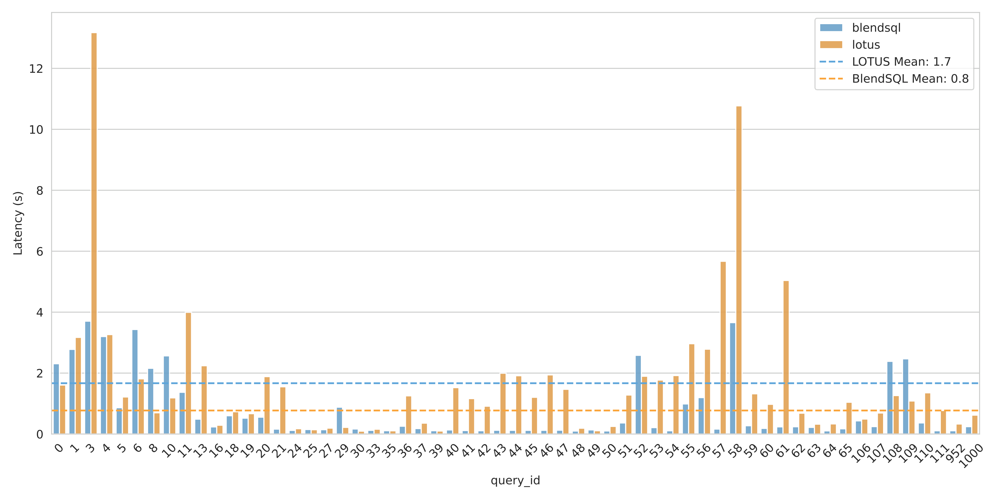

<div align="right">
<a href="https://opensource.org/licenses/Apache-2.0"></a>
<a></a>
<a></a>
<a></a>
<a href="https://discord.gg/vCv7ak3WrU"></a>
<br>
</div>

<div align="center"><picture>
  <source media="(prefers-color-scheme: dark)" srcset="docs/img/logo_dark.png">
  
</picture>
</div>

```sql 
SELECT {{
    LLMQA(
        'Describe BlendSQL in 50 words.',
        context=(
            SELECT content[0:5000] AS "README"
            FROM read_text('https://raw.githubusercontent.com/parkervg/blendsql/main/README.md')
        )
    )
}} AS answer
```

<div align="center"><picture>
<p align="center">
    <i> SQL 🤝 LLMs </i>
  </p>
<b><h3>Check out our <a href="https://parkervg.github.io/blendsql/reference/functions/" target="_blank">online documentation</a> for a more comprehensive overview.</h3></b>
<b><h4>Join our <a href="https://discord.gg/vCv7ak3WrU" target="_blank">Discord server</a> for more discussion!</h4></b>
</div>
<br/>

# 💻 Installation
```
pip install blendsql
```

<details>
<summary><h1>⭐ Quickstart</h1></summary>

```python
import pandas as pd

from blendsql import BlendSQL
from blendsql.models import LlamaCpp, LiteLLM

USE_LOCAL_CONSTRAINED_MODEL = False

# Load model, either a local LlamaCpp model, or remote provider via LiteLLM
if USE_LOCAL_CONSTRAINED_MODEL:
    # Local models enable BlendSQL's expression-guided constrained decoding
    # https://arxiv.org/abs/2509.20208    
    model = LlamaCpp(
        model_name_or_path="bartowski/Llama-3.2-3B-Instruct-GGUF",
        filename="Llama-3.2-3B-Instruct-Q6_K.gguf", 
        config={"n_gpu_layers": -1, "n_ctx": 8000, "seed": 100, "n_threads": 16},
    ) 
else:
    model = LiteLLM("openai/gpt-4o-mini")

# Prepare our BlendSQL connection
bsql = BlendSQL(
    {
        "People": pd.DataFrame(
            {
                "Name": [
                    "George Washington",
                    "John Adams",
                    "Thomas Jefferson",
                    "James Madison",
                    "James Monroe",
                    "Alexander Hamilton",
                    "Sabrina Carpenter",
                    "Charli XCX",
                    "Elon Musk",
                    "Michelle Obama",
                    "Elvis Presley",
                ],
                "Known_For": [
                    "Established federal government, First U.S. President",
                    "XYZ Affair, Alien and Sedition Acts",
                    "Louisiana Purchase, Declaration of Independence",
                    "War of 1812, Constitution",
                    "Monroe Doctrine, Missouri Compromise",
                    "Created national bank, Federalist Papers",
                    "Nonsense, Emails I Cant Send, Mean Girls musical",
                    "Crash, How Im Feeling Now, Boom Clap",
                    "Tesla, SpaceX, Twitter/X acquisition",
                    "Lets Move campaign, Becoming memoir",
                    "14 Grammys, King of Rock n Roll",
                ],
            }
        ),
        "Eras": pd.DataFrame({"Years": ["1700-1800", "1800-1900", "1900-2000", "2000-Now"]}),
    },
    model=model,
    verbose=True,
)

smoothie = bsql.execute(
    """
    SELECT * FROM People P
    WHERE P.Name IN {{
        LLMQA('First 3 presidents of the U.S?', quantifier='{3}')
    }}
    """,
    infer_gen_constraints=True, # Is `True` by default
)

print(smoothie.df)
# ┌───────────────────┬───────────────────────────────────────────────────────┐
# │ Name              │ Known_For                                             │
# ├───────────────────┼───────────────────────────────────────────────────────┤
# │ George Washington │ Established federal government, First U.S. Preside... │
# │ John Adams        │ XYZ Affair, Alien and Sedition Acts                   │
# │ Thomas Jefferson  │ Louisiana Purchase, Declaration of Independence       │
# └───────────────────┴───────────────────────────────────────────────────────┘
print(smoothie.summary())
# ┌────────────┬──────────────────────┬─────────────────┬─────────────────────┐
# │   Time (s) │   # Generation Calls │   Prompt Tokens │   Completion Tokens │
# ├────────────┼──────────────────────┼─────────────────┼─────────────────────┤
# │    1.25158 │                    1 │             296 │                  16 │
# └────────────┴──────────────────────┴─────────────────┴─────────────────────┘


smoothie = bsql.execute(
    """
    SELECT GROUP_CONCAT(Name, ', ') AS 'Names',
    {{
        LLMMap(
            'In which time period was this person born?',
            p.Name,
            options=Eras.Years
        )
    }} AS Born
    FROM People p
    GROUP BY Born
    """,
)

print(smoothie.df)
# ┌───────────────────────────────────────────────────────┬───────────┐
# │ Names                                                 │ Born      │
# ├───────────────────────────────────────────────────────┼───────────┤
# │ George Washington, John Adams, Thomas Jefferson, J... │ 1700-1800 │
# │ Sabrina Carpenter, Charli XCX, Elon Musk, Michelle... │ 2000-Now  │
# │ Elvis Presley                                         │ 1900-2000 │
# └───────────────────────────────────────────────────────┴───────────┘
print(smoothie.summary())
# ┌────────────┬──────────────────────┬─────────────────┬─────────────────────┐
# │   Time (s) │   # Generation Calls │   Prompt Tokens │   Completion Tokens │
# ├────────────┼──────────────────────┼─────────────────┼─────────────────────┤
# │    1.03858 │                    2 │             544 │                  75 │
# └────────────┴──────────────────────┴─────────────────┴─────────────────────┘

smoothie = bsql.execute("""
    SELECT {{
        LLMQA(
            'Describe BlendSQL in 50 words.',
            context=(
                SELECT content[0:5000] AS "README"
                FROM read_text('https://raw.githubusercontent.com/parkervg/blendsql/main/README.md')
            )
        )
    }} AS answer
""")

print(smoothie.df)
# ┌─────────────────────────────────────────────────────┐
# │ answer                                              │
# ├─────────────────────────────────────────────────────┤
# │ BlendSQL is a Python library that combines SQL a... │
# └─────────────────────────────────────────────────────┘

print(smoothie.summary())

# ┌────────────┬──────────────────────┬─────────────────┬─────────────────────┐
# │   Time (s) │   # Generation Calls │   Prompt Tokens │   Completion Tokens │
# ├────────────┼──────────────────────┼─────────────────┼─────────────────────┤
# │    4.07617 │                    1 │            1921 │                  50 │
# └────────────┴──────────────────────┴─────────────────┴─────────────────────┘
```
</details>

# Summary

BlendSQL is a *superset of SQL* for problem decomposition and hybrid question-answering with LLMs.

As a result, we can *Blend* together...

- 🥤 ...operations over heterogeneous data sources (e.g. tables, text, images)
- 🥤 ...the structured & interpretable reasoning of SQL with the generalizable reasoning of LLMs

At its core, BlendSQL follows a simple design principle: be lazy. This is embodied in a few different ways - [don't eagerly materialize CTEs unless we need to](https://github.com/parkervg/blendsql/pull/19), [only load language models into memory if we use them](https://github.com/parkervg/blendsql/blob/main/blendsql/models/model.py#L213), [only pass values to scalar LM functions in `SELECT` statements *after* applying `LIMIT` clauses](https://github.com/parkervg/blendsql/pull/27), etc.

But, at a higher level: Existing DBMS (database management systems) are already highly optimized, and many very smart people get paid a lot of money to keep them at the cutting-edge. Rather than reinvent the wheel, we can leverage their optimizations and only pull the subset of data into memory that is *logically required* to pass to the language model functions. We then prep the database state via temporary tables, and finally sync back to the native SQL dialect and execute. In this way, blendsql 'compiles to SQL'.

For more info on query execution in BlendSQL, see Section 2.4 [here](https://arxiv.org/pdf/2509.20208). 

# 📰 News
- (11/7/25) 📝New paper: [Play by the Type Rules: Inferring Constraints for LLM Functions in Declarative Programs](https://arxiv.org/abs/2509.20208)
- (5/30/25) Created a [Discord server](https://discord.gg/vCv7ak3WrU)
- (5/6/25): New blog post: [Language Models, SQL, and Types, Oh My!](https://parkervg.github.io/misc/2025/05/05/sql-llms.html)
- (5/1/15): Single-page [function documentation](https://parkervg.github.io/blendsql/reference/functions/)
- (3/16/25) Use BlendSQL with 100+ LLM APIs, using [LiteLLM](https://github.com/BerriAI/litellm)!
- (10/26/24) New tutorial! [blendsql-by-example.ipynb](examples/blendsql-by-example.ipynb)
- (10/18/24) Concurrent async requests in 0.0.29! OpenAI and Anthropic `LLMMap` calls are speedy now.
  - Customize max concurrent async calls via `blendsql.config.set_async_limit(10)`

# Features

- Supports many DBMS 💾
  - SQLite, PostgreSQL, DuckDB, Pandas (aka duckdb in a trenchcoat)
- Supports local & remote models ✨
  - Transformers, OpenAI, Anthropic, Ollama, and 100+ more!
- Write your normal queries - smart parsing optimizes what is passed to external functions 🧠
  - Traverses abstract syntax tree with [sqlglot](https://github.com/tobymao/sqlglot) to minimize LLM function calls 🌳
- Constrained decoding with [guidance](https://github.com/guidance-ai/guidance) 🚀
  - When using local models, we only generate syntactically valid outputs according to query syntax + database contents
- LLM function caching, built on [diskcache](https://grantjenks.com/docs/diskcache/) 🔑

# Benchmarks 

On a dataset of complex questions converted to executable declarative programs (e.g. *How many test
takers are there at the school/s in a county with population over 2 million?*), **BlendSQL is 53% faster than the pandas-based LOTUS**.
See Section 4 of [Play by the Type Rules: Inferring Constraints for LLM Functions in Declarative Programs](https://arxiv.org/abs/2509.20208) for more details. 




### But - why not just define UDFs? 

Many DBMS allow for the creation of Python user-defined functions (UDFs), like [DuckDB](https://duckdb.org/docs/stable/clients/python/function). So why not just use those to embed language model functions instead of BlendSQL?
The below plot adds the DuckDB UDF approach to the same benchmark we did above - where DuckDB UDFs come in with at average of 133.2 seconds per query.  


The reason for this? DuckDB uses a generalized query optimizer, very good at many different optimizations. But when we introduce a UDF with an unknown cost, many values get passed to the highly expensive language model functions that could have been filtered out via vanilla SQL expressions first (`JOIN`, `WHERE`, `LIMIT`, etc.).

This highlights an important point about the value-add of BlendSQL. While you *can* just import the individual language model functions and call them on data (see [here](https://github.com/parkervg/blendsql/blob/duckdb-udf-eval/research/run-evaluate.py#L42)) - if you know the larger query context where the function output will be used, you *should* use the BlendSQL query optimizer (`bsql.execute()`), built specifically for language model functions. As demonstrated above, it makes a huge difference for large database contexts, and out-of-the-box UDFs without the ability to assign cost don't cut it.

> [!TIP]
> How do we know the BlendSQL optimizer is passing the minimal required data to the language model functions? Check out our extensive [test suite](./tests/) for examples.

# Documentation 

- [Simple Row-Wise Classification](#simple-row-wise-classification)
- [Search-then-Map ](#search-then-map)
    - [Specifying `return_type`](#specifying-return_type)
- [Search-then-Reduce ](#search-then-map)
- [Few-Shot Prompting](#few-shot-prompting)

The below examples can use this model initialization logic to define the variable `model`:

```python
from blendsql.models import LlamaCpp, LiteLLM

USE_LOCAL_CONSTRAINED_MODEL = True 
if USE_LOCAL_CONSTRAINED_MODEL:
    # Local models enable BlendSQL's expression-guided constrained decoding
    # https://arxiv.org/abs/2509.20208    
    model = LlamaCpp(
        model_name_or_path="bartowski/Llama-3.2-3B-Instruct-GGUF",
        filename="Llama-3.2-3B-Instruct-Q6_K.gguf", 
        config={"n_gpu_layers": -1, "n_ctx": 8000, "seed": 100, "n_threads": 16},
    ) 
else:
    model = LiteLLM("openai/gpt-4o-mini")
```

## Simple Row-Wise Classification 

```python
import pandas as pd
from blendsql import BlendSQL

if __name__ == "__main__":
    bsql = BlendSQL(
        {
            "posts": pd.DataFrame(
                {"content": ["I hate this product", "I love this product"]}
            )
        },
        model=model,
        verbose=True,
    )

    smoothie = bsql.execute(
        """
        SELECT {{
            LLMMap(
                'What is the sentiment of this text?',
                content,
                options=('positive', 'negative')
            )      
        }} AS classification FROM posts
        """
    )
    print(smoothie.df)
```

## Search-then-Map 

Some question answering tasks require hybrid reasoning - some information is present in a given table, but some information exists only in external free text documents. 

```python
import pandas as pd 

from blendsql import BlendSQL
    
bsql = BlendSQL(
    {
        "world_aquatic_championships": pd.DataFrame(
            [
                {
                    "Medal": "Silver",
                    "Name": "Dana Vollmer",
                    "Sport": "Swimming",
                    "Event": "Women's 100 m butterfly",
                    "Time/Score": "56.87",
                    "Date": "July 25",
                },
                {
                    "Medal": "Gold",
                    "Name": "Ryan Lochte",
                    "Sport": "Swimming",
                    "Event": "Men's 200 m freestyle",
                    "Time/Score": "1:44.44",
                },
                {
                    "Medal": "Gold",
                    "Name": "Rebecca Soni",
                    "Sport": "Swimming",
                    "Event": "Women's 100 m breaststroke",
                    "Time/Score": "1:05.05",
                    "Date": "July 26",
                },
                {
                    "Medal": "Gold",
                    "Name": "Elizabeth Beisel",
                    "Sport": "Swimming",
                    "Event": "Women's 400 m individual medley",
                    "Time/Score": "4:31.78",
                    "Date": "July 31",
                },
            ]
        )
    },
    model=model,
    verbose=True, # Set `verbose=True` to see the query plan as it executes
)

_ = bsql.model.model_obj # Models are lazy loaded by default. Use this line if you want to pre-load models before execution.
```

We can now create a custom function that will: 
  1) Fill in our f-string templatized question with values in the database
  2) Batch-retrieve top `k` relevant documents for each unrolled question 
  3) Batch-apply the provied language model to generate a type constrained output given the document contexts 

```python
from blendsql.search import TavilySearch, FaissVectorStore
from blendsql.ingredients import LLMMap

USE_TAVILY = True # This requires a `.env` file with a `TAVILY_API_KEY` variable defined
if USE_TAVILY:
  searcher = TavilySearch(k=3)
else:
  # We can also define a local FAISS vector store
  searcher = FaissVectorStore(
    documents=[
      "Ryan Steven Lochte (/ˈlɒkti/ LOK-tee; born August 3, 1984) is an American former[2] competition swimmer and 12-time Olympic medalist.",
      "Rebecca Soni (born March 18, 1987) is an American former competition swimmer and breaststroke specialist.",
      "Elizabeth Lyon Beisel (/ˈbaɪzəl/; born August 18, 1992) is an American competition swimmer who specializes in backstroke and individual medley events."
    ],
    k=3
  )

DocumentSearchMap = LLMMap.from_args(
  searcher=searcher
)

# This line registers our new function in our `BlendSQL` connection context
# Replacement scans allow us to now reference the function by the variable name we initialized it to (`DocumentSearchMap`)
bsql.ingredients = {DocumentSearchMap} 

# Define a blendsql program to answer: 'What is the name of the oldest person who won gold?'
smoothie = bsql.execute(
    """
    SELECT Name FROM world_aquatic_championships w
    WHERE Medal = 'Gold'
    /* By default, blendsql infers type constraints given expression context. */ 
    /* So below, the return_type will be constrained to an integer (`\d+`) */ 
    ORDER BY {{DocumentSearchMap('What year was {} born?', w.Name)}} ASC LIMIT 1
    """
)

print(smoothie.df)
# ┌─────────────┐
# │ Name        │
# ├─────────────┤
# │ Ryan Lochte │
# └─────────────┘
```

To analyze the prompts we sent to the model, we can access `GLOBAL_HISTORY`. 

```python
from blendsql import GLOBAL_HISTORY

# This is a list
print(GLOBAL_HISTORY)
```

## Specifying `return_type`

Notice in the above example - what if two athletes were born in the same year, but different days? 

In this case, simply fetching the year of birth isn't enough for the ordering we need to do. For cases when the required datatype is unable to be inferred via expression context, you can override the inferred default via passing `return_type`. The following are valid. 

| `return_type` Argument | Regex                                                                                                  | DB Mapping Logic                                                                                                                     |
|------------------------|--------------------------------------------------------------------------------------------------------|--------------------------------------------------------------------------------------------------------------------------------------|
| `any`                  | N.A.                                                                                                   | N.A. The DB implicitly casts the type, if type affinity is supported (e.g. SQLite does this).                                        |
| `str`                  | N.A.                                                                                                   | N.A. Same behavior as `any`, but the language model is prompted with the cue that the return type should look like a string.         |
| `int`                  | `r"-?(\d+)"`                                                                                           |                                                                                                                                      |
| `float`                | `r"-?(\d+(\.\d+)?)"`                                                                                   |                                                                                                                                      |
| `bool`                 | `r"(t\|f\|true\|false\|True\|False)"`                                                                  |                                                                                                                                      |
| `substring`            | complicated - see https://github.com/guidance-ai/guidance/blob/main/guidance/library/_substring.py#L11 |                                                                                                                                      |
| `date`                 | `r"\d{4}-\d{2}-\d{2}"`                                                                                 | The ISO8601 is inserted into the query as a date type. This differs for different DBMS - in DuckDB, it would be `'1992-09-20'::DATE` |

```python
smoothie = bsql.execute(
    """
    SELECT Name FROM world_aquatic_championships w
    WHERE Medal = 'Gold'
    /* Defining `return_type = 'date'` will constrain generation to a date format, and handle type conversion to the respective database context for you. */  
    /* For example, DuckDB and SQLite stores dates as a ISO8601 string */
    ORDER BY {{DocumentSearchMap('When was {} born?', w.Name, return_type='date')}} ASC LIMIT 1
    """
)
```

## Search-then-Reduce  

Below we use the scalar `LLMQA` function to do a search over our documents with the question formatted with a value from the structured `european_countries` table.

```python 
import pandas as pd 

from blendsql import BlendSQL
from blendsql.search import FaissVectorStore
from blendsql.ingredients import LLMQA

bsql = BlendSQL(
    {
        "documents": pd.DataFrame(
            [
                {
                    "title": "Steve Nash",
                    "content": "Steve Nash played college basketball at Santa Clara University",
                },
                {
                    "title": "E.F. Codd",
                    "content": 'Edgar Frank "Ted" Codd (19 August 1923 – 18 April 2003) was a British computer scientist who, while working for IBM, invented the relational model for database management, the theoretical basis for relational databases and relational database management systems.',
                },
                {
                    "title": "George Washington (February 22, 1732 – December 14, 1799) was a Founding Father and the first president of the United States, serving from 1789 to 1797."
                },
                {
                    "title": "Thomas Jefferson",
                    "content": "Thomas Jefferson (April 13, 1743 – July 4, 1826) was an American Founding Father and the third president of the United States from 1801 to 1809.",
                },
                {
                    "title": "John Adams",
                    "content": "John Adams (October 30, 1735 – July 4, 1826) was an American Founding Father who was the second president of the United States from 1797 to 1801.",
                },
            ]
        ),
        "european_countries": pd.DataFrame(
            [
                {
                    "Country": "Portugal",
                    "Area (km²)": 91568,
                    "Population (As of 2011)": 10555853,
                    "Population density (per km²)": 115.2,
                    "Capital": "Lisbon",
                },
                {
                    "Country": "Sweden",
                    "Area (km²)": 449964,
                    "Population (As of 2011)": 9088728,
                    "Population density (per km²)": 20.1,
                    "Capital": "Stockholm",
                },
                {
                    "Country": "United Kingdom",
                    "Area (km²)": 244820,
                    "Population (As of 2011)": 62300000,
                    "Population density (per km²)": 254.4,
                    "Capital": "London",
                },
            ]
        ),
    },
    model=model,
    verbose=True,
)

USE_SEARCH = True 
if USE_SEARCH:
  LLMQA = LLMQA.from_args(
    searcher=FaissVectorStore(
      documents=bsql.db.execute_to_list("SELECT DISTINCT title || content FROM documents"),
      k=3
    )
  )
  bsql.ingredients = {LLMQA}

smoothie = bsql.execute(
"""
SELECT {{
    LLMQA(
      'Who is from {}?', 
      /* The below subquery gets executed, and the result is inserted into the below `{}`. */
      (
        SELECT Country FROM european_countries c
        WHERE Capital = 'London'
      )
    )
}} AS answer
"""
)
print(smoothie.df)
# ┌────────────┐
# │ answer     │
# ├────────────┤
# │ E.F. Codd  │
# └────────────┘
```


## Few-Shot Prompting
For the LLM-based ingredients in BlendSQL, few-shot prompting can be vital. In `LLMMap`, `LLMQA` and `LLMJoin`, we provide an interface to pass custom few-shot examples and dynamically retrieve those top-`k` most relevant examples at runtime, given the current inference example.
#### `LLMMap`
- [Default examples](./blendsql/ingredients/builtin/map/default_examples.json)
- [All possible fields](./blendsql/ingredients/builtin/map/examples.py)

```python
from blendsql import BlendSQL
from blendsql.ingredients.builtin import LLMMap, DEFAULT_MAP_FEW_SHOT

ingredients = {
  LLMMap.from_args(
    few_shot_examples=[
      *DEFAULT_MAP_FEW_SHOT,
      {
        "question": "Is this a sport?",
        "mapping": {
          "Soccer": True,
          "Chair": False,
          "Banana": False,
          "Golf": True
        },
        # Below are optional
        "column_name": "Items",
        "table_name": "Table",
        "return_type": "boolean"
      }
    ],
    num_few_shot_examples=2,
    # How many inference values to pass to model at once
    batch_size=5,
  )
}

bsql = BlendSQL(db, ingredients=ingredients)
```

#### `LLMQA`
- [Default examples](./blendsql/ingredients/builtin/qa/default_examples.json)
- [All possible fields](./blendsql/ingredients/builtin/qa/examples.py)

```python
from blendsql import BlendSQL
from blendsql.ingredients.builtin import LLMQA, DEFAULT_QA_FEW_SHOT

ingredients = {
    LLMQA.from_args(
        few_shot_examples=[
            *DEFAULT_QA_FEW_SHOT,
            {
                "question": "Which weighs the most?",
                "context": {
                    {
                        "Animal": ["Dog", "Gorilla", "Hamster"],
                        "Weight": ["20 pounds", "350 lbs", "100 grams"]
                    }
                },
                "answer": "Gorilla",
                # Below are optional
                "options": ["Dog", "Gorilla", "Hamster"]
            }
        ],
        # Will fetch `k` most relevant few-shot examples using embedding-based retriever
        num_few_shot_examples=2,
        # Lambda to turn the pd.DataFrame to a serialized string
        context_formatter=lambda df: df.to_markdown(
            index=False
        )
    )
}

bsql = BlendSQL(db, ingredients=ingredients)
```

#### `LLMJoin`
- [Default examples](./blendsql/ingredients/builtin/join/default_examples.json)
- [All possible fields](./blendsql/ingredients/builtin/join/examples.py)

```python
from blendsql import BlendSQL
from blendsql.ingredients.builtin import LLMJoin, DEFAULT_JOIN_FEW_SHOT

ingredients = {
  LLMJoin.from_args(
    few_shot_examples=[
      *DEFAULT_JOIN_FEW_SHOT,
      {
        "join_criteria": "Join the state to its capital.",
        "left_values": ["California", "Massachusetts", "North Carolina"],
        "right_values": ["Sacramento", "Boston", "Chicago"],
        "mapping": {
          "California": "Sacramento",
          "Massachusetts": "Boston",
          "North Carolina": "-"
        }
      }
    ],
    num_few_shot_examples=2
  )
}

bsql = BlendSQL(db, ingredients=ingredients)
```

# Citation

```bibtex
@article{glenn2024blendsql,
      title={BlendSQL: A Scalable Dialect for Unifying Hybrid Question Answering in Relational Algebra},
      author={Parker Glenn and Parag Pravin Dakle and Liang Wang and Preethi Raghavan},
      year={2024},
      eprint={2402.17882},
      archivePrefix={arXiv},
      primaryClass={cs.CL}
}
```

# Acknowledgements
Special thanks to those below for inspiring this project. Definitely recommend checking out the linked work below, and citing when applicable!

- The authors of [Binding Language Models in Symbolic Languages](https://arxiv.org/abs/2210.02875)
  - This paper was the primary inspiration for BlendSQL.
- The authors of [EHRXQA: A Multi-Modal Question Answering Dataset for Electronic Health Records with Chest X-ray Images](https://arxiv.org/pdf/2310.18652)
  - As far as I can tell, the first publication to propose unifying model calls within SQL
  - Served as the inspiration for the [vqa-ingredient.ipynb](./examples/vqa-ingredient.ipynb) example
- The authors of [Grammar Prompting for Domain-Specific Language Generation with Large Language Models](https://arxiv.org/abs/2305.19234)
- The maintainers of the [Guidance](https://github.com/guidance-ai/guidance) library for powering the constrained decoding capabilities of BlendSQL
